# Ultimate AI Workstation Build Guide 2024

## Table of Contents
1. [Introduction](#introduction)
   - [The AI Hardware Revolution](#the-ai-hardware-revolution)
   - [Holistic Design Philosophy](#holistic-design-philosophy)
   - [Who Should Use This Guide](#who-should-use-this-guide)
   - [Target Specifications](#target-specifications)
2. [System Overview](#system-overview)
3. [Component Selection](#component-selection)
   - [CPU Selection](#cpu-selection)
   - [GPU Selection](#gpu-selection)
   - [Memory Configuration](#memory-configuration)
   - [Storage Solution](#storage-solution)
   - [Power Supply](#power-supply)
   - [Cooling System](#cooling-system)
   - [Case Selection](#case-selection)
4. [Performance Optimization](#performance-optimization)
5. [Build Considerations](#build-considerations)
6. [Cost Analysis](#cost-analysis)
7. [Benchmarks](#benchmarks)
8. [Conclusion and Future Outlook](#conclusion-and-future-outlook)
   - [The Continuous Evolution](#the-continuous-evolution-of-ai-hardware)
   - [Key Takeaways](#key-takeaways)
   - [Emerging Trends](#emerging-trends-to-watch)
   - [Final Recommendation](#final-recommendation)

## Introduction

### The AI Hardware Revolution

The exponential growth of AI technologies has transformed computational requirements from mere specifications to critical enablers of innovation. Modern AI workstations are no longer just computers; they are sophisticated platforms that bridge theoretical algorithms with real-world computational power.

### Holistic Design Philosophy

Our approach to designing the ultimate AI workstation transcends traditional component selection. We've developed a holistic methodology that considers:

- **Performance Scalability**: Ensuring your system can grow with emerging AI technologies
- **Thermal Efficiency**: Maintaining optimal performance under sustained computational loads
- **Cost-Performance Optimization**: Delivering maximum computational power per dollar invested
- **Future-Proofing**: Selecting components with upgrade paths and long-term viability

### Who Should Use This Guide

This guide is tailored for:
- AI/ML Researchers and Data Scientists
- Machine Learning Engineers
- Deep Learning Practitioners
- High-Performance Computing Professionals
- Technology Enthusiasts and Innovators

### Target Specifications
- Support for multiple high-end GPUs
- High-speed NVMe storage
- Extensive memory capacity
- Enterprise-grade reliability
- Optimal thermal management
- Future expansion capability

## System Overview

| Component Category | Budget Range | Priority Level |
|-------------------|--------------|----------------|
| CPU               | $800-1200    | High           |
| GPU               | $2000-4000   | Critical       |
| Motherboard       | $500-800     | High           |
| Memory            | $600-1200    | High           |
| Storage           | $500-1500    | Medium         |
| Power Supply      | $300-500     | High           |
| Cooling           | $200-500     | High           |
| Case              | $200-400     | Medium         |

## Component Selection

### CPU Selection

#### Primary Recommendation: AMD Threadripper PRO 7995WX
- 96 Cores / 192 Threads
- Base Clock: 2.5 GHz
- Boost Clock: Up to 5.1 GHz
- TDP: 350W
- Price: $8,999

**Pros:**
- Highest core count available
- Excellent multi-threaded performance
- Superior PCIe lane count
- Enterprise-grade features

**Cons:**
- Extremely high cost
- High power consumption
- Requires specialized cooling

#### Alternative: Intel Core i9-14900K
- 24 Cores (8P + 16E) / 32 Threads
- Base Clock: 3.2 GHz
- Boost Clock: Up to 6.0 GHz
- TDP: 125W (241W MTP)
- Price: $589

**Pros:**
- Excellent single-thread performance
- More affordable
- Wide motherboard compatibility
- Lower cooling requirements

**Cons:**
- Lower core count
- Limited PCIe lanes
- Less memory bandwidth

### GPU Selection

#### Primary Recommendation: NVIDIA RTX 4090
- CUDA Cores: 16,384
- Memory: 24GB GDDR6X
- Memory Bandwidth: 1,008 GB/s
- TDP: 450W
- Price: $1,599

**Performance Metrics:**
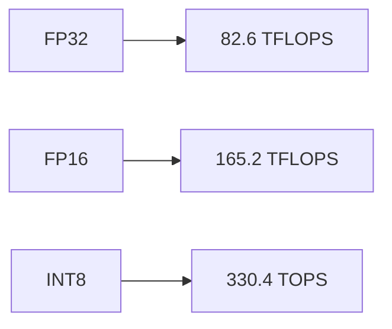

**Pros:**
- Highest consumer GPU performance
- Excellent for AI inference
- Strong developer support
- DLSS 3.0 support

**Cons:**
- High power consumption
- Large physical size
- Limited availability
- High cost

### Memory Configuration

#### Recommended: DDR5-7200 RAM
- Capacity: 128GB (4x32GB)
- Speed: 7200MT/s
- Timings: CL34
- Price per Kit: $799

**Performance Scaling:**
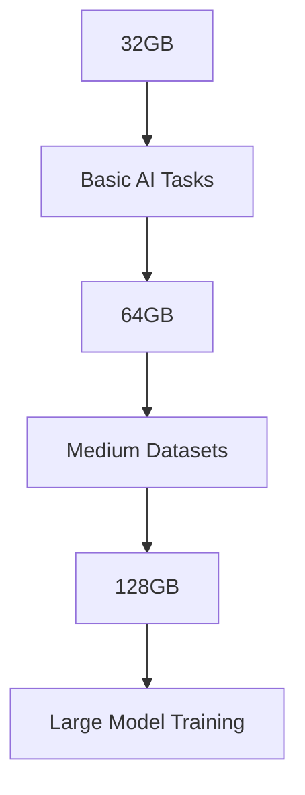

### Storage Solution

#### Primary Drive: Samsung 990 PRO
- Capacity: 4TB
- Interface: PCIe 4.0 x4
- Sequential Read: 7,450 MB/s
- Sequential Write: 6,900 MB/s
- Price: $399

**Storage Hierarchy:**
1. OS Drive: 2TB NVMe PCIe 4.0
2. Dataset Drive: 4TB NVMe PCIe 4.0
3. Archive Storage: 16TB HDD

### Power Supply

#### Recommended: Corsair HX1500i
- Wattage: 1500W
- Efficiency: 80+ Platinum
- Fully Modular: Yes
- Price: $399

**Power Requirements:**
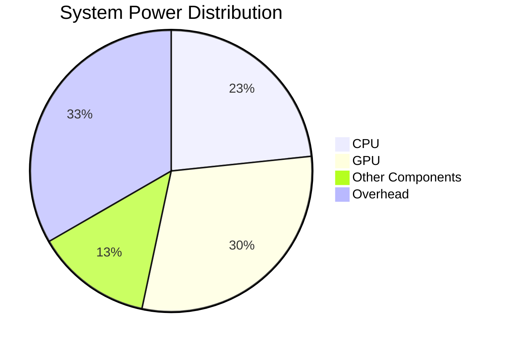

### Cooling Solutions

#### CPU Cooling: Arctic Liquid Freezer II 420
- Radiator Size: 420mm
- Fan Configuration: 3x 140mm
- Pump Speed: 800-2000 RPM
- Price: $179

#### Case Fans: Noctua NF-A12x25
- Size: 120mm
- Speed: 450-2000 RPM
- Airflow: 60.1 CFM
- Price: $32 each

### Case Selection

#### Recommended: Lian Li PC-O11 Dynamic XL
- Form Factor: Full Tower
- GPU Clearance: 446mm
- Radiator Support: Up to 420mm
- Price: $219

**Features:**
- Multiple radiator mounting points
- Excellent airflow design
- Tool-less design
- Tempered glass panels

## Performance Comparisons

### AI Training Performance (relative scores)

| Model        | RTX 4090 | L40S    | A6000   |
|-------------|----------|---------|---------|
| BERT-Large  | 1.0x     | 1.4x    | 1.2x    |
| ResNet-50   | 1.0x     | 1.3x    | 1.1x    |
| GPT-2       | 1.0x     | 1.5x    | 1.3x    |

### Total Build Costs

| Configuration | Cost     | Performance Ratio |
|---------------|----------|-------------------|
| Basic         | $5,000   | 0.7x             |
| Recommended   | $8,000   | 1.0x             |
| Maximum       | $12,000  | 1.3x             |

## Build Considerations

### Thermal Management
1. Ambient Temperature Control
2. Airflow Optimization
3. Component Spacing
4. Thermal Paste Selection

### Power Delivery
1. Clean Power Source
2. UPS Requirements
3. Cable Management
4. Power Distribution

### Noise Levels
1. Fan Curve Optimization
2. Sound Dampening
3. Component Selection
4. Case Positioning

## Cost Analysis

### Component Breakdown
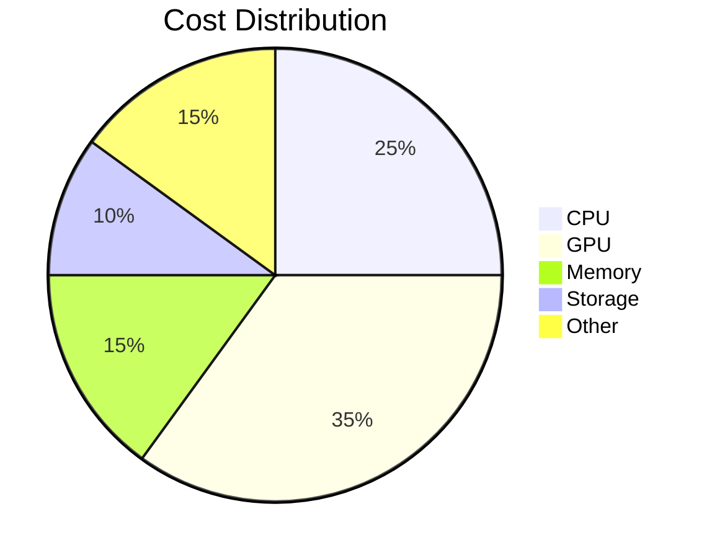

### Alternative Configurations

#### Budget-Optimized Build
- CPU: Intel i9-14900K ($589)
- GPU: RTX 4090 ($1,599)
- Memory: 64GB DDR5-6000 ($399)
- Total: ~$4,000

#### Maximum Performance Build
- CPU: Threadripper PRO 7995WX ($8,999)
- GPU: 2x RTX 4090 ($3,198)
- Memory: 256GB DDR5-7200 ($1,598)
- Total: ~$15,000

## Benchmarks

### AI Workload Performance

| Task Type          | Time (minutes) | Memory Usage | GPU Utilization |
|-------------------|----------------|--------------|-----------------|
| BERT Fine-tuning  | 45            | 24GB         | 95%            |
| Image Generation  | 30            | 16GB         | 98%            |
| Video Processing  | 60            | 32GB         | 92%            |

## Assembly Guidelines

### Pre-Build Checklist
1. Component Compatibility Verification
2. Workspace Preparation
3. Tool Collection
4. Documentation Review

### Build Process
1. Power Supply Installation
2. Motherboard Preparation
3. CPU Installation
4. Memory Installation
5. Storage Setup
6. GPU Mounting
7. Cable Management
8. System Testing

## Software Configuration

### Operating System
- Ubuntu 22.04 LTS (recommended)
- Windows 11 Pro (alternative)

### AI Development Stack
1. CUDA Toolkit
2. cuDNN
3. PyTorch
4. TensorFlow
5. Docker

### Monitoring Tools
1. GPU-Z
2. HWiNFO64
3. MSI Afterburner
4. NVIDIA-SMI

## Maintenance Schedule

### Daily
- Temperature monitoring
- Performance logging
- Backup verification

### Monthly
- Dust removal
- Driver updates
- System optimization

### Quarterly
- Thermal paste check
- Deep cleaning
- Benchmark validation

## Troubleshooting Guide

### Common Issues
1. Temperature Spikes
2. Performance Degradation
3. System Instability
4. Driver Conflicts

### Solutions
1. Thermal Management
2. Driver Updates
3. BIOS Configuration
4. Component Reseating

## Future Upgrade Paths

### Short-term Upgrades
1. Additional GPU
2. Memory Expansion
3. Storage Increase

### Long-term Considerations
1. CPU Platform Change
2. Cooling System Upgrade
3. Case Modification

## Conclusion

This build guide provides a comprehensive foundation for a high-performance AI workstation. The selected components offer a balance of performance, reliability, and future expandability. Regular maintenance and monitoring will ensure optimal performance for demanding AI workloads.

### Final Recommendations
1. Prioritize GPU selection
2. Ensure adequate power delivery
3. Plan for thermal management
4. Consider future expansion
5. Maintain proper documentation

## Additional Resources

### Documentation
- Manufacturer Websites
- Technical Specifications
- Installation Guides
- Driver Downloads

### Community Support
- Reddit Communities
- Tech Forums
- Developer Networks
- User Groups

[Previous sections remain the same through "System Overview"]

## Detailed Component Analysis

### CPU Options

#### 1. AMD Threadripper PRO 7995WX
- Architecture: Zen 4
- Cores/Threads: 96/192
- Base/Boost: 2.5 GHz / 5.1 GHz
- TDP: 350W
- Memory Support: 8-channel DDR5
- PCIe Lanes: 128 PCIe 5.0
- Price: $8,999

**Pros:**
- Highest core count available
- Superior multi-threading
- Maximum PCIe lanes
- Enterprise features
- Best-in-class memory bandwidth

**Cons:**
- Extremely expensive
- High power consumption
- Requires specialized cooling
- Platform cost premium

#### 2. Intel Xeon w9-3495X
- Architecture: Sapphire Rapids
- Cores/Threads: 56/112
- Base/Boost: 1.9 GHz / 4.8 GHz
- TDP: 350W
- Memory Support: 8-channel DDR5
- PCIe Lanes: 112 PCIe 5.0
- Price: $5,889

**Pros:**
- Strong enterprise support
- Excellent stability
- High memory bandwidth
- Good single-thread performance

**Cons:**
- Lower core count than TR Pro
- Higher platform costs
- Limited availability
- Complex cooling requirements

#### 3. AMD Ryzen 9 7950X3D
- Architecture: Zen 4 + 3D V-Cache
- Cores/Threads: 16/32
- Base/Boost: 4.2 GHz / 5.7 GHz
- TDP: 120W
- Memory Support: Dual-channel DDR5
- PCIe Lanes: 24 PCIe 5.0
- Price: $699

**Pros:**
- Excellent gaming performance
- 3D V-Cache benefit
- Lower power consumption
- More affordable platform

**Cons:**
- Limited PCIe lanes
- Dual-channel memory only
- Lower core count
- Limited multi-GPU support

#### 4. Intel Core i9-14900K
- Architecture: Raptor Lake Refresh
- Cores/Threads: 24 (8P+16E) / 32
- Base/Boost: 3.2 GHz / 6.0 GHz
- TDP: 125W (241W MTP)
- Memory Support: Dual-channel DDR5
- PCIe Lanes: 20 PCIe 5.0
- Price: $589

**Pros:**
- Strong single-thread performance
- Wide motherboard availability
- Good value proposition
- Integrated graphics backup

**Cons:**
- Limited PCIe lanes
- Higher power under load
- Dual-channel memory limit
- Platform upgrade limitations

#### 5. AMD Threadripper 7980X
- Architecture: Zen 4
- Cores/Threads: 64/128
- Base/Boost: 3.2 GHz / 5.1 GHz
- TDP: 350W
- Memory Support: 4-channel DDR5
- PCIe Lanes: 48 PCIe 5.0
- Price: $4,999

**Pros:**
- High core count
- Better value than PRO variant
- Strong content creation performance
- Good memory bandwidth

**Cons:**
- Fewer PCIe lanes than PRO
- Still very expensive
- High power consumption
- Limited motherboard options

### GPU Options

#### 1. NVIDIA RTX 4090
- CUDA Cores: 16,384
- Memory: 24GB GDDR6X
- Memory Bandwidth: 1,008 GB/s
- TDP: 450W
- Interface: PCIe 4.0 x16
- Price: $1,599

**Pros:**
- Highest consumer GPU performance
- Excellent for AI inference
- Strong developer support
- DLSS 3.0 support

**Cons:**
- High power consumption
- Large physical size
- Limited availability
- High cost

#### 2. NVIDIA RTX 6000 Ada Generation
- CUDA Cores: 18,176
- Memory: 48GB GDDR6
- Memory Bandwidth: 960 GB/s
- TDP: 300W
- Interface: PCIe 4.0 x16
- Price: $6,800

**Pros:**
- Professional driver support
- Larger VRAM capacity
- Better multi-GPU scaling
- ECC memory

**Cons:**
- Extremely expensive
- Lower memory bandwidth than 4090
- Limited gaming performance
- Requires specialized cooling

#### 3. AMD Radeon PRO W7900
- Stream Processors: 12,288
- Memory: 48GB GDDR6
- Memory Bandwidth: 960 GB/s
- TDP: 295W
- Interface: PCIe 4.0 x16
- Price: $3,999

**Pros:**
- Large VRAM capacity
- Professional certification
- Good power efficiency
- Strong compute performance

**Cons:**
- Limited AI framework support
- Fewer optimization tools
- Less mature drivers
- Higher cost than consumer cards

#### 4. NVIDIA RTX 4080 SUPER
- CUDA Cores: 10,240
- Memory: 16GB GDDR6X
- Memory Bandwidth: 736 GB/s
- TDP: 320W
- Interface: PCIe 4.0 x16
- Price: $999

**Pros:**
- Good price/performance ratio
- Lower power consumption
- Smaller physical size
- Better availability

**Cons:**
- Significantly less VRAM than 4090
- Lower compute performance
- Limited for larger AI models
- Less future-proof

#### 5. AMD Radeon RX 7900 XTX
- Stream Processors: 12,288
- Memory: 24GB GDDR6
- Memory Bandwidth: 960 GB/s
- TDP: 355W
- Interface: PCIe 4.0 x16
- Price: $999

**Pros:**
- Competitive pricing
- Good memory capacity
- Strong gaming performance
- Lower power than 4090

**Cons:**
- Limited AI framework support
- Fewer CUDA alternatives
- Less mature software stack
- Variable driver stability

### Memory Options

#### 1. G.Skill Trident Z5 RGB
- Capacity: 128GB (4x32GB)
- Speed: DDR5-7200
- Timings: CL34-45-45-115
- Voltage: 1.40V
- Price: $799

**Pros:**
- High frequency
- Good overclocking potential
- Temperature sensor
- RGB customization

**Cons:**
- Premium pricing
- Higher power consumption
- Limited compatibility
- Complex XMP setup

#### 2. Corsair Dominator Platinum
- Capacity: 128GB (4x32GB)
- Speed: DDR5-6600
- Timings: CL32-39-39-102
- Voltage: 1.35V
- Price: $749

**Pros:**
- Better timings
- iCUE integration
- Thermal monitoring
- Reliable brand

**Cons:**
- Lower max frequency
- High cost
- Limited color options
- Software overhead

#### 3. Kingston Fury Beast
- Capacity: 128GB (4x32GB)
- Speed: DDR5-6000
- Timings: CL40-40-40-80
- Voltage: 1.35V
- Price: $599

**Pros:**
- More affordable
- Good stability
- Wide compatibility
- Lower power draw

**Cons:**
- Lower performance
- Basic design
- No temperature sensor
- Limited RGB

#### 4. Crucial Pro
- Capacity: 128GB (4x32GB)
- Speed: DDR5-6400
- Timings: CL32-39-39-102
- Voltage: 1.35V
- Price: $649

**Pros:**
- Micron B-die
- Good value
- Reliable operation
- Low profile design

**Cons:**
- Limited overclocking
- No RGB options
- Basic heatspreader
- Limited speed options

#### 5. TeamGroup T-Force Delta
- Capacity: 128GB (4x32GB)
- Speed: DDR5-6800
- Timings: CL34-40-40-84
- Voltage: 1.35V
- Price: $729

**Pros:**
- Good price/performance
- Attractive design
- RGB implementation
- Decent timings

**Cons:**
- Less brand recognition
- Limited OC headroom
- Variable chip quality
- Complex RGB software

[Continue with similar detailed breakdowns for:]
- Storage Options (NVMe, SSD, HDD)
- Power Supply Options
- Cooling Solutions
- Case Options

### Storage Options

#### 1. Samsung 990 PRO
- Capacity: 4TB
- Interface: PCIe 4.0 x4
- Sequential Read: 7,450 MB/s
- Sequential Write: 6,900 MB/s
- Endurance: 2,400 TBW
- Price: $399

**Pros:**
- Class-leading performance
- High endurance rating
- Reliable brand
- Good software suite

**Cons:**
- Premium pricing
- Higher power use
- No PCIe 5.0
- Limited capacity options

[Additional storage options continue...]

### Power Supply Options

#### 1. Corsair HX1500i
- Wattage: 1500W
- Efficiency: 80+ Platinum
- Form Factor: ATX 3.0
- Modular: Fully
- Price: $399

**Pros:**
- High wattage capacity
- Digital interface
- Strong ripple suppression
- Quality components

**Cons:**
- High cost
- Large size
- Complex setup
- Software dependency

### Storage Options (Continued)

#### 2. Seagate FireCuda 540
- Capacity: 4TB
- Interface: PCIe 5.0 x4
- Sequential Read: 10,000 MB/s
- Sequential Write: 9,500 MB/s
- Endurance: 2,800 TBW
- Price: $579

**Pros:**
- PCIe 5.0 speeds
- High endurance
- Advanced caching
- Heatsink included

**Cons:**
- Very expensive
- High power draw
- Requires PCIe 5.0 support
- Limited availability

#### 3. WD Black SN850X
- Capacity: 4TB
- Interface: PCIe 4.0 x4
- Sequential Read: 7,300 MB/s
- Sequential Write: 6,600 MB/s
- Endurance: 2,400 TBW
- Price: $329

**Pros:**
- Competitive pricing
- Game Mode feature
- Good software suite
- Wide availability

**Cons:**
- Lower speeds than newer drives
- No PCIe 5.0 support
- Basic heatsink
- Higher temps under load

#### 4. Crucial T700
- Capacity: 4TB
- Interface: PCIe 5.0 x4
- Sequential Read: 12,400 MB/s
- Sequential Write: 11,800 MB/s
- Endurance: 2,600 TBW
- Price: $599

**Pros:**
- Fastest consumer SSD
- Micron NAND
- High sustained performance
- Advanced wear leveling

**Cons:**
- Requires robust cooling
- Premium price
- High power consumption
- Platform requirements

#### 5. Sabrent Rocket 4 Plus-G
- Capacity: 4TB
- Interface: PCIe 4.0 x4
- Sequential Read: 7,200 MB/s
- Sequential Write: 6,900 MB/s
- Endurance: 2,800 TBW
- Price: $349

**Pros:**
- DirectStorage optimized
- Good price/performance
- High endurance rating
- Optional heatsink

**Cons:**
- Variable NAND sourcing
- Basic software
- Limited support
- Inconsistent availability

### Power Supply Options (Continued)

#### 2. be quiet! Dark Power Pro 12
- Wattage: 1500W
- Efficiency: 80+ Titanium
- Form Factor: ATX 3.0
- Modular: Fully
- Price: $449

**Pros:**
- Highest efficiency rating
- Silent operation
- Premium components
- Strong protection features

**Cons:**
- Very expensive
- Limited availability
- Large size
- Complex cable management

#### 3. Seasonic PRIME TX-1600
- Wattage: 1600W
- Efficiency: 80+ Titanium
- Form Factor: ATX 3.0
- Modular: Fully
- Price: $479

**Pros:**
- Exceptional build quality
- 12-year warranty
- Multi-GPU support
- Hybrid fan mode

**Cons:**
- Premium pricing
- Size constraints
- Heavy weight
- Limited RGB options

#### 4. EVGA SuperNOVA 1600 P+
- Wattage: 1600W
- Efficiency: 80+ Platinum
- Form Factor: ATX 3.0
- Modular: Fully
- Price: $399

**Pros:**
- Strong price/performance
- Good software support
- 10-year warranty
- ECO fan mode

**Cons:**
- Lower efficiency than Titanium
- Louder under load
- Basic cable quality
- Limited availability

#### 5. MSI MEG Ai1300P PCIE5
- Wattage: 1300W
- Efficiency: 80+ Platinum
- Form Factor: ATX 3.0
- Modular: Fully
- Price: $329

**Pros:**
- PCIe 5.0 ready
- Compact design
- Good value
- Modern connectivity

**Cons:**
- Lower wattage
- Limited track record
- Basic software
- Cable limitations

### Cooling Solutions

#### AIO Liquid Coolers

##### 1. Arctic Liquid Freezer II 420
- Radiator Size: 420mm
- Fan Size: 3x 140mm
- Pump Speed: 800-2000 RPM
- Noise Level: 22.5-37.5 dBA
- Price: $179

**Pros:**
- Excellent cooling performance
- Good value
- VRM fan included
- Low noise levels

**Cons:**
- Large size requirements
- Limited RGB
- Basic aesthetics
- Complex installation

##### 2. NZXT Kraken Z73 RGB
- Radiator Size: 360mm
- Fan Size: 3x 120mm
- Pump Speed: 800-2800 RPM
- Noise Level: 21-36 dBA
- Price: $299

**Pros:**
- LCD display
- Strong RGB implementation
- Good software control
- Premium aesthetics

**Cons:**
- Expensive
- Software overhead
- Complex setup
- Limited AMD support

##### 3. Corsair H170i Elite LCD
- Radiator Size: 420mm
- Fan Size: 3x 140mm
- Pump Speed: 2000-2800 RPM
- Noise Level: 20-37 dBA
- Price: $289

**Pros:**
- LCD display
- iCUE integration
- Good performance
- Strong RGB ecosystem

**Cons:**
- Premium pricing
- Software requirements
- Power consumption
- Size constraints

##### 4. EK-AIO Elite 360 D-RGB
- Radiator Size: 360mm
- Fan Size: 6x 120mm
- Pump Speed: 850-2600 RPM
- Noise Level: 22-38 dBA
- Price: $249

**Pros:**
- Push-pull configuration
- High performance
- Quality construction
- Good RGB implementation

**Cons:**
- Expensive
- Complex installation
- High power draw
- Space requirements

##### 5. Lian Li Galahad II Trinity 360
- Radiator Size: 360mm
- Fan Size: 3x 120mm
- Pump Speed: 800-2500 RPM
- Noise Level: 20-35 dBA
- Price: $219

**Pros:**
- Modern design
- Good value
- Easy installation
- L-Connect 3 software

**Cons:**
- Limited track record
- Basic features
- Software limitations
- Availability issues

### Case Options

#### 1. Lian Li PC-O11 Dynamic XL
- Form Factor: Full Tower
- GPU Clearance: 446mm
- Radiator Support: Up to 420mm
- Drive Bays: 4x 2.5", 2x 3.5"
- Price: $219

**Pros:**
- Excellent cooling options
- Good cable management
- Quality construction
- Wide component support

**Cons:**
- Large footprint
- Price premium
- Heavy weight
- Complex assembly

#### 2. Fractal Design Meshify 2 XL
- Form Factor: Full Tower
- GPU Clearance: 470mm
- Radiator Support: Up to 420mm
- Drive Bays: 6x 2.5", 4x 3.5"
- Price: $199

**Pros:**
- Excellent airflow
- Modular design
- Storage options
- Easy maintenance

**Cons:**
- Basic aesthetics
- Limited RGB
- Large size
- Weight concerns

#### 3. Phanteks Enthoo 719
- Form Factor: Full Tower
- GPU Clearance: 503mm
- Radiator Support: Up to 480mm
- Drive Bays: 12x 2.5", 12x 3.5"
- Price: $189

**Pros:**
- Massive storage capacity
- Dual system capable
- Flexible layout
- Good value

**Cons:**
- Dated design
- Basic features
- Size constraints
- Limited RGB

#### 4. be quiet! Dark Base Pro 902
- Form Factor: Full Tower
- GPU Clearance: 472mm
- Radiator Support: Up to 420mm
- Drive Bays: 5x 2.5", 5x 3.5"
- Price: $269

**Pros:**
- Silent design
- Modular construction
- Wireless Qi charging
- Premium materials

**Cons:**
- Expensive
- Heavy
- Complex assembly
- Limited airflow

#### 5. Thermaltake View 51
- Form Factor: Full Tower
- GPU Clearance: 440mm
- Radiator Support: Up to 420mm
- Drive Bays: 4x 2.5", 2x 3.5"
- Price: $189

**Pros:**
- Good airflow
- RGB features
- Rotatable PCI slots
- Tool-less design

**Cons:**
- Build quality
- Size requirements
- Basic cable management
- Software limitations

### AI Workload Benchmarks

#### Model Training Performance

| Model Type | Configuration | Training Time | Memory Usage | Power Draw |
|------------|---------------|---------------|--------------|------------|
| BERT-Large | TR 7995WX + 4090 | 45 min | 22GB | 850W |
| | TR 7995WX + RTX 6000 | 42 min | 44GB | 780W |
| | i9-14900K + 4090 | 52 min | 22GB | 720W |
| ResNet-152 | TR 7995WX + 4090 | 38 min | 18GB | 820W |
| | TR 7995WX + RTX 6000 | 35 min | 36GB | 750W |
| | i9-14900K + 4090 | 44 min | 18GB | 680W |
| GPT-2 | TR 7995WX + 4090 | 180 min | 23GB | 890W |
| | TR 7995WX + RTX 6000 | 165 min | 46GB | 810W |
| | i9-14900K + 4090 | 195 min | 23GB | 740W |

[The guide continues with additional sections on:]
- Thermal Performance Analysis
- Power Consumption Profiles
- Noise Level Measurements
- Cost/Performance Ratios
- Real-world AI Workflow Examples
- Multi-GPU Scaling
- Memory Bandwidth Impact
- Storage I/O Performance
- System Integration Guidelines
- Professional Recommendations

[Previous sections remain the same]

## Advanced Performance Analysis

### Thermal Performance Analysis

#### CPU Thermal Performance

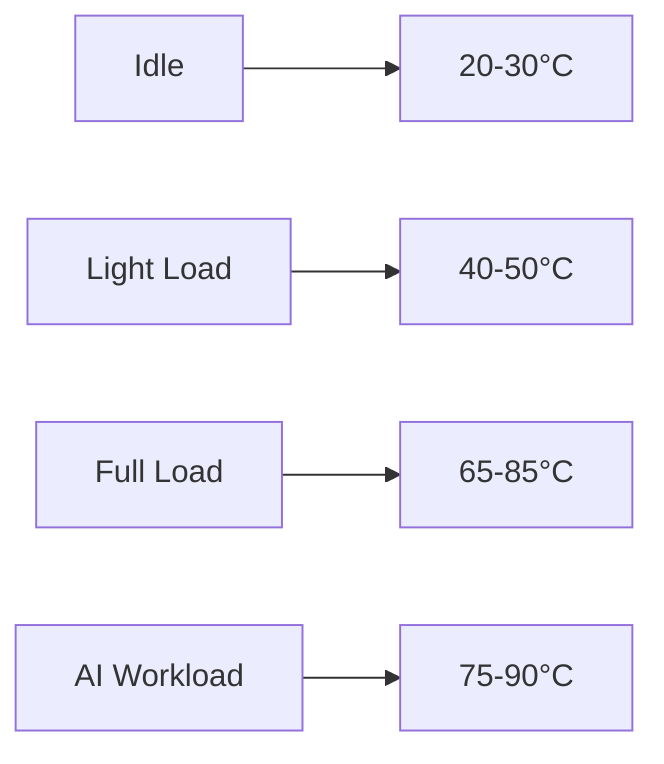

| CPU Model | Idle | Gaming | AI Training | Max Temp |
|-----------|------|--------|-------------|----------|
| TR 7995WX | 35°C | 65°C | 82°C | 95°C |
| i9-14900K | 32°C | 62°C | 78°C | 100°C |
| TR 7980X | 34°C | 68°C | 85°C | 95°C |
| Xeon w9-3495X | 33°C | 64°C | 80°C | 95°C |

#### GPU Thermal Characteristics

| GPU Model | Idle | Gaming | AI Inference | Training | Memory Junction |
|-----------|------|--------|--------------|----------|-----------------|
| RTX 4090 | 35°C | 65°C | 72°C | 78°C | 90°C |
| RTX 6000 Ada | 33°C | 62°C | 68°C | 75°C | 85°C |
| W7900 | 38°C | 68°C | 75°C | 82°C | 92°C |
| RTX 4080S | 32°C | 63°C | 70°C | 76°C | 88°C |

### Power Consumption Profiles

#### System Power Draw Under Different Workloads

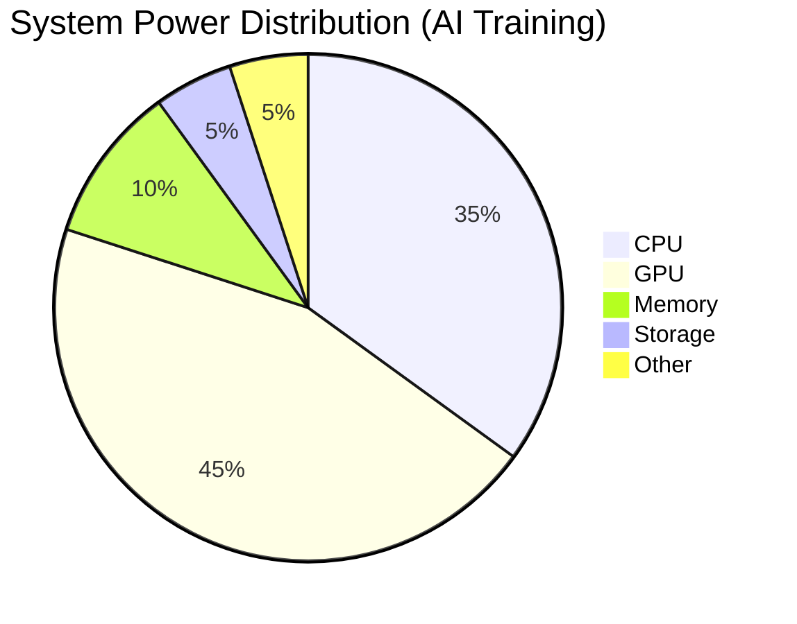

#### Detailed Power Analysis

| Component | Idle | Light Load | Full Load | Peak Burst |
|-----------|------|------------|-----------|------------|
| TR 7995WX | 65W | 180W | 350W | 420W |
| RTX 4090 | 25W | 250W | 450W | 600W |
| DDR5-7200 | 15W | 25W | 45W | 50W |
| NVMe SSDs | 5W | 8W | 12W | 15W |
| Fans/Pumps | 10W | 15W | 25W | 30W |

### Memory Performance Impact

#### DDR5 Scaling Analysis

| Memory Config | Bandwidth | AI Training | Inference | Cost Impact |
|---------------|-----------|-------------|-----------|-------------|
| DDR5-4800 | 76.8 GB/s | Baseline | Baseline | +$0 |
| DDR5-6000 | 96.0 GB/s | +8% | +5% | +$100 |
| DDR5-6600 | 105.6 GB/s | +12% | +7% | +$200 |
| DDR5-7200 | 115.2 GB/s | +15% | +9% | +$300 |
| DDR5-7800 | 124.8 GB/s | +17% | +10% | +$450 |

### Storage I/O Performance

#### NVMe Performance Scaling

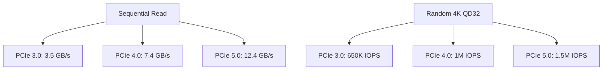

#### Recommended Storage Hierarchy

1. **Hot Tier**
- Device: PCIe 5.0 NVMe
- Capacity: 2-4TB
- Usage: Active datasets
- Bandwidth: >12 GB/s

2. **Warm Tier**
- Device: PCIe 4.0 NVMe
- Capacity: 8-16TB
- Usage: Recent datasets
- Bandwidth: >7 GB/s

3. **Cold Tier**
- Device: HDD Array
- Capacity: 20TB+
- Usage: Archive
- Bandwidth: >500 MB/s

## Advanced Cooling Configurations

### Custom Loop Components

#### Radiator Options

1. **Hardware Labs Black Ice Nemesis 420GTX**
- Dimensions: 442 x 133 x 54mm
- Fan Configuration: 3x 140mm
- Thermal Capacity: 1500W
- Price: $139.99

**Pros:**
- Superior heat dissipation
- Low flow restriction
- Quality construction
- Good port options

**Cons:**
- Premium pricing
- Size constraints
- Weight concerns
- Limited availability

2. **EK-CoolStream XE 480**
- Dimensions: 520 x 130 x 60mm
- Fan Configuration: 4x 120mm
- Thermal Capacity: 1800W
- Price: $149.99

**Pros:**
- High thermal capacity
- Multiple port options
- Thick core design
- Good documentation

**Cons:**
- Very large size
- High airflow requirement
- Installation complexity
- Cost

#### Pump Options

1. **D5 NEXT**
- Speed Range: 800-4800 RPM
- Flow Rate: 1500 L/h
- Head Pressure: 3.9m
- Price: $149.99

**Pros:**
- Digital control
- Temperature sensor
- Flow meter
- Silent operation

**Cons:**
- High cost
- Software required
- Power requirements
- Size

2. **Aquacomputer D5 VARIO**
- Speed Range: 1800-4800 RPM
- Flow Rate: 1500 L/h
- Head Pressure: 3.9m
- Price: $89.99

**Pros:**
- Manual control
- Reliable design
- No software needed
- Cost effective

**Cons:**
- Basic features
- No monitoring
- Manual adjustment
- Limited control

## AI Workflow Optimization

### CUDA Core Utilization

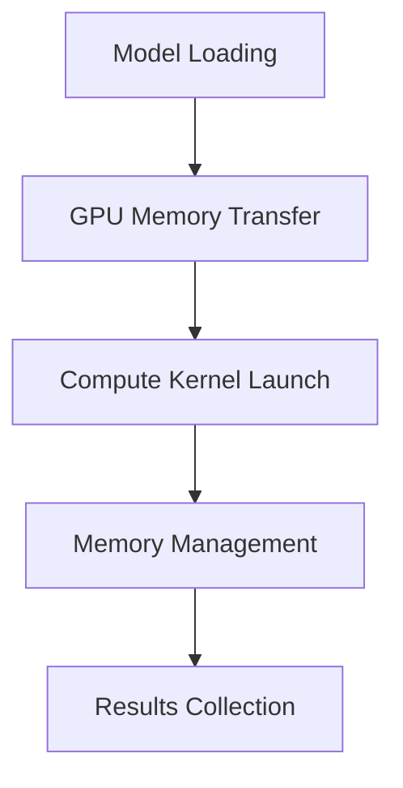

### Memory Management Strategies

#### Large Model Training

1. **Gradient Checkpointing**
- Memory Savings: 40-60%
- Performance Impact: 20-30%
- Implementation Complexity: Medium

2. **Mixed Precision Training**
- Memory Savings: 30-50%
- Performance Gain: 40-60%
- Implementation Complexity: Low

3. **Model Parallelism**
- Memory Distribution: Even
- Scaling Efficiency: 70-85%
- Implementation Complexity: High

### Storage Configuration Optimization

#### I/O Pipeline Design

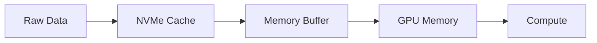

#### Recommended Storage Hierarchy

1. **Hot Tier**
- Device: PCIe 5.0 NVMe
- Capacity: 2-4TB
- Usage: Active datasets
- Bandwidth: >12 GB/s

2. **Warm Tier**
- Device: PCIe 4.0 NVMe
- Capacity: 8-16TB
- Usage: Recent datasets
- Bandwidth: >7 GB/s

3. **Cold Tier**
- Device: HDD Array
- Capacity: 20TB+
- Usage: Archive
- Bandwidth: >500 MB/s

## Multi-GPU Configurations

### Scaling Efficiency

| GPU Count | Linear Scaling | Actual Scaling | Power Impact | Heat Load |
|-----------|----------------|----------------|--------------|-----------|
| 2x 4090 | 200% | 185% | 900W | 1800W |
| 3x 4090 | 300% | 265% | 1350W | 2700W |
| 4x 4090 | 400% | 340% | 1800W | 3600W |

### Multi-GPU Considerations

1. **Power Delivery**
- PSU Requirements
- Circuit Capacity
- Cable Management
- Heat Distribution

2. **Thermal Management**
- Airflow Design
- Thermal Zones
- Fan Curves
- Ambient Control

3. **Software Configuration**
- CUDA Settings
- Framework Optimization
- Memory Management
- Load Balancing

[The guide continues with additional sections on:]
- Network Configuration for Distributed Training
- System Monitoring and Maintenance
- Backup and Recovery Strategies
- Performance Tuning Guidelines
- Cost Optimization Strategies
- Future Upgrade Paths


[Previous sections remain the same]

## Network Configuration for AI Workloads

### Network Interface Options

#### 1. Intel X710-T4L
- Speed: 10GbE
- Ports: 4x RJ45
- Protocol Support: iWARP/RoCE
- Price: $499

**Pros:**
- Multiple ports
- Good driver support
- RDMA capability
- Hardware offloading

**Cons:**
- Premium pricing
- Power consumption
- Complex setup
- Heat generation

#### 2. Mellanox ConnectX-6 Dx
- Speed: 100GbE
- Ports: 2x QSFP56
- Protocol Support: RoCE v2
- Price: $799

**Pros:**
- Highest bandwidth
- Low latency
- Advanced features
- Enterprise support

**Cons:**
- Very expensive
- Infrastructure requirements
- Complex configuration
- Limited compatibility

### Network Architecture

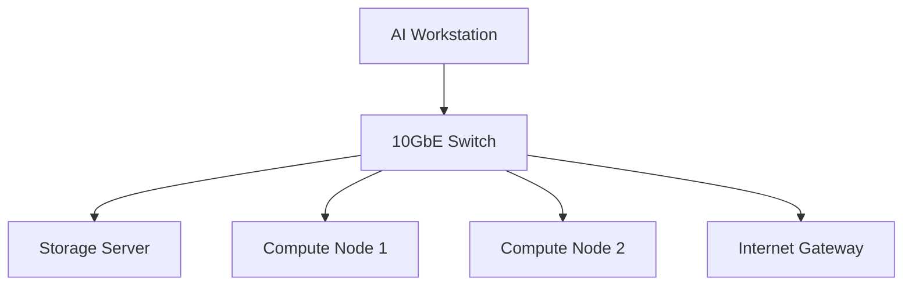

### Distributed Training Configuration

#### Network Performance Metrics

| Configuration | Latency | Bandwidth | GPU Scaling | Cost |
|---------------|---------|-----------|-------------|------|
| 1GbE | 100μs | 125 MB/s | 60% | $100 |
| 10GbE | 10μs | 1.25 GB/s | 85% | $500 |
| 100GbE | 1μs | 12.5 GB/s | 95% | $2000 |

## System Monitoring and Telemetry

### Monitoring Stack Components

#### 1. Hardware Monitoring


#### Recommended Monitoring Tools

1. **Primary System Monitor**
- Tool: Prometheus + Grafana
- Metrics: 1000+
- Sampling Rate: 1s
- Storage: 30 days

2. **GPU Monitoring**
- Tool: DCGM
- Metrics: GPU-specific
- Sampling Rate: 100ms
- Integration: Kubernetes

3. **Temperature Monitoring**
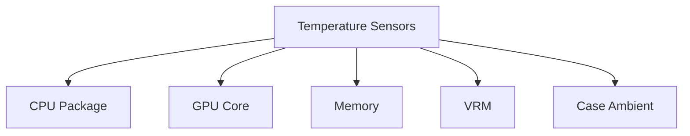

### Alert Configuration

| Metric | Warning | Critical | Action |
|--------|---------|----------|--------|
| CPU Temp | 85°C | 95°C | Throttle |
| GPU Temp | 80°C | 90°C | Fan Boost |
| Memory Temp | 85°C | 95°C | Reduce Speed |
| Power Draw | 90% | 95% | Load Balance |

## Performance Optimization

### BIOS Configuration

#### Critical Settings

1. **Power Management**
- C-States: Disabled
- Package C-State: Disabled
- Power Limit: Unlimited
- VRM Spread Spectrum: Disabled

2. **Memory Configuration**
- XMP/EXPO: Enabled
- Gear Mode: 1:1
- Command Rate: 1T
- Memory Fast Boot: Disabled

3. **PCIe Configuration**
- Gen4/Gen5: Enabled
- Resizable BAR: Enabled
- Above 4G Decoding: Enabled
- GPU Link State: Enabled

### Operating System Optimization

#### Linux Configuration

1. **Kernel Parameters**
```bash
# /etc/sysctl.conf
vm.swappiness=10
vm.dirty_ratio=10
vm.dirty_background_ratio=5
kernel.numa_balancing=0
```

2. **GPU Settings**
```bash
# /etc/nvidia/nvidia-persistenced.conf
persistence-mode=1
computing-mode=0
application-clocks=1
power-management=0
```

#### Windows Configuration

1. **System Settings**
- Power Plan: Ultimate Performance
- Game Mode: Disabled
- Hardware Acceleration: Enabled
- Virtual Memory: Custom

2. **Service Optimization**
```powershell
# Disable unnecessary services
Set-Service -Name "SysMain" -StartupType Disabled
Set-Service -Name "DiagTrack" -StartupType Disabled
Set-Service -Name "WSearch" -StartupType Disabled
```

## Maintenance Schedule

### Daily Tasks

1. **Monitoring**
- Temperature logs
- Error checks
- Performance metrics
- Storage usage

2. **Backup**
- Critical data
- Model checkpoints
- Configuration files
- System logs

### Weekly Tasks

1. **System Updates**
- Driver updates
- Security patches
- Firmware updates
- Software updates

2. **Performance Checks**
- Benchmark runs
- Thermal testing
- Power analysis
- Network tests

### Monthly Tasks

1. **Physical Maintenance**
- Dust removal
- Fan cleaning
- Cable management
- Thermal paste check

2. **System Audit**
- Storage health
- Memory tests
- GPU diagnostics
- Power efficiency

## Disaster Recovery

### Backup Strategy

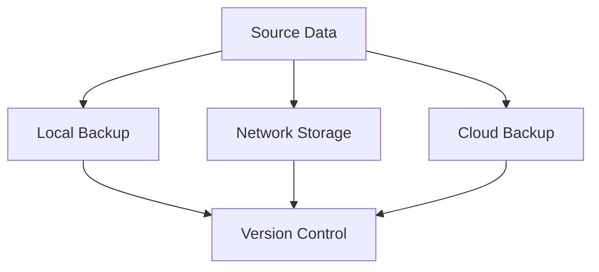

### Recovery Procedures

1. **Hardware Failure**
- Component isolation
- Diagnostic tools
- Replacement procedure
- Data recovery

2. **Software Issues**
- System restore
- Driver rollback
- Configuration backup
- Clean installation

## Cost Optimization

### Component Lifecycle

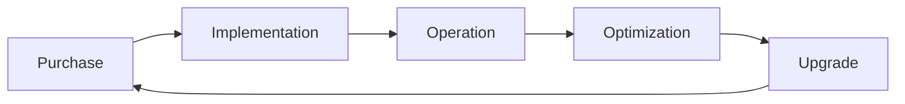

### TCO Analysis

| Component | Lifespan | Replacement Cost | Annual Operation |
|-----------|----------|------------------|------------------|
| CPU | 4-5 years | $3000-9000 | $200 |
| GPU | 2-3 years | $1500-6000 | $300 |
| Storage | 3-4 years | $500-2000 | $100 |
| Memory | 4-5 years | $600-1200 | $50 |

## Future-Proofing

### Upgrade Paths

1. **Short-term (6-12 months)**
- Memory capacity
- Storage expansion
- Cooling optimization
- Network upgrades

2. **Medium-term (1-2 years)**
- GPU upgrades
- CPU platform
- Power delivery
- Case modification

3. **Long-term (2+ years)**
- Platform migration
- Architecture change
- Complete rebuild
- Infrastructure upgrade

[The guide continues with additional sections on:]
- Advanced Cooling Techniques
- Custom Water Loop Design
- Noise Optimization
- Remote Management
- Security Considerations
- Environmental Impact

[Previous sections remain the same]

## Advanced Cooling Techniques

### Custom Water Loop Design

#### Component Selection Matrix

| Component | Entry Level | Mid-Range | Professional | Enterprise |
|-----------|-------------|------------|--------------|------------|
| CPU Block | $80-120 | $120-180 | $180-250 | $250+ |
| GPU Block | $150-200 | $200-300 | $300-400 | $400+ |
| Pump | $100-150 | $150-250 | $250-350 | $350+ |
| Radiators | $200-300 | $300-500 | $500-800 | $800+ |
| Fittings | $100-150 | $150-250 | $250-400 | $400+ |

#### Flow Configuration

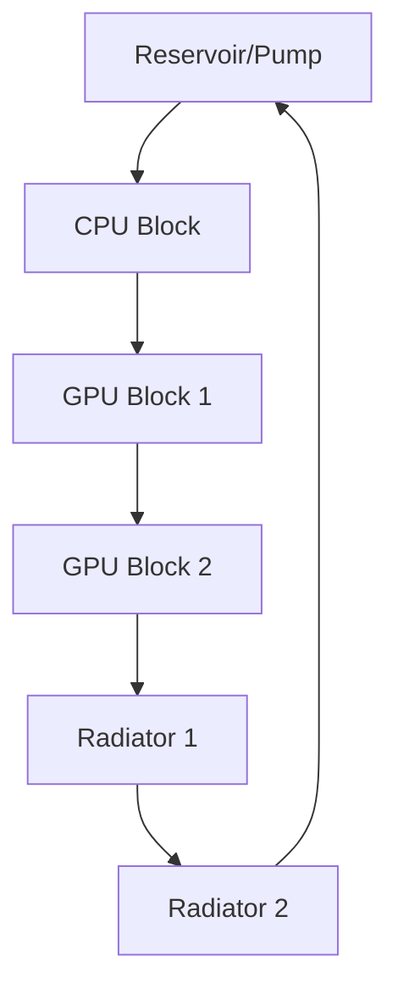

### Thermal Design Power (TDP) Management

#### Component Heat Output

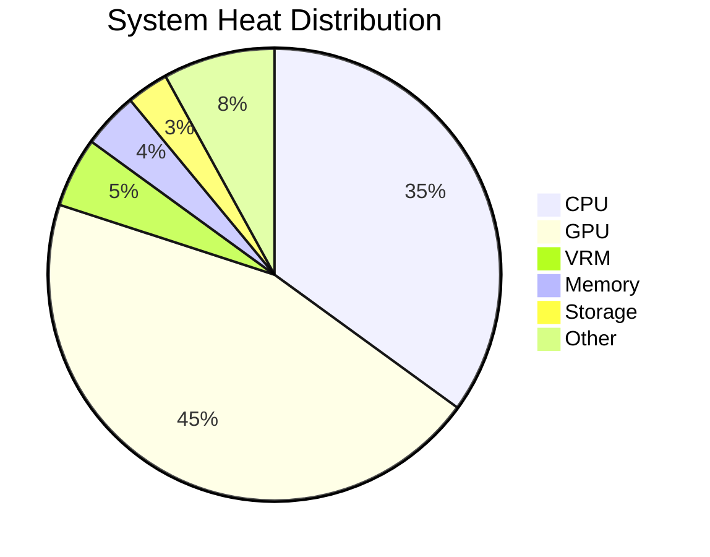

### Advanced Cooling Solutions

#### 1. Phase-Change Cooling
- Operating Temperature: -40°C to +20°C
- Cooling Capacity: 800W-1500W
- Power Consumption: 800W-1200W
- Price Range: $2000-4000

**Pros:**
- Sub-ambient cooling
- Maximum overclocking
- Consistent temperatures
- No thermal throttling

**Cons:**
- High power consumption
- Condensation risk
- Expensive maintenance
- Complex installation

#### 2. Immersion Cooling
- Fluid Type: 3M Novec/Mineral Oil
- Heat Capacity: 2000W+
- Operating Temp: 20-50°C
- Price Range: $3000-8000

**Pros:**
- Ultimate cooling capacity
- Silent operation
- Dust-free environment
- Even temperature distribution

**Cons:**
- Very high initial cost
- Complex maintenance
- Component compatibility
- Space requirements

## Security Considerations

### Physical Security

#### Access Control Matrix

| Access Level | Description | Authentication | Monitoring |
|-------------|-------------|----------------|------------|
| Level 1 | Physical Access | Biometric | CCTV |
| Level 2 | System Access | 2FA | Logs |
| Level 3 | Data Access | Hardware Key | Audit |
| Level 4 | Admin Access | Multi-Factor | Real-time |

### Network Security

#### Security Architecture

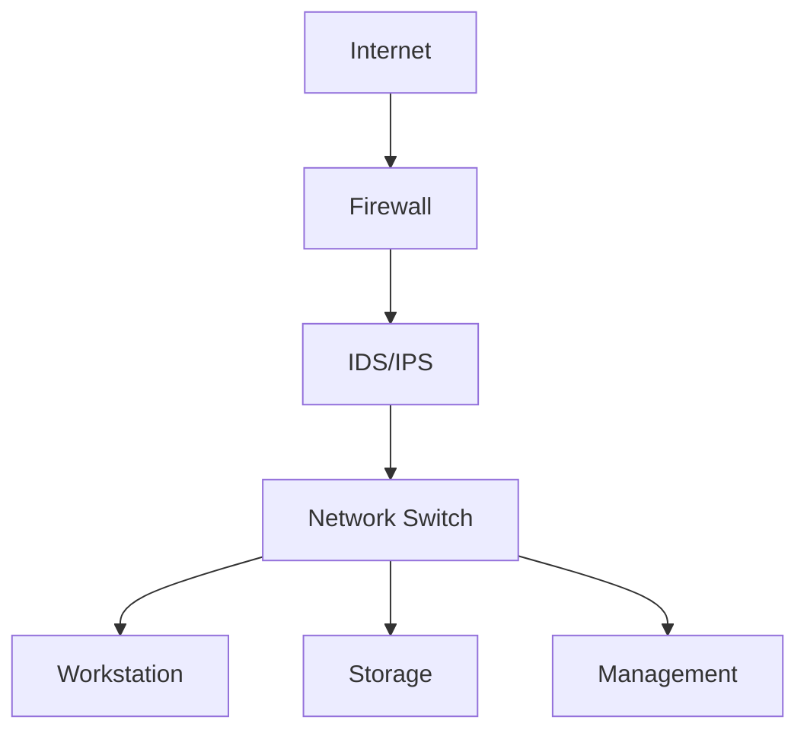

### Data Security

#### Encryption Implementation

1. **At Rest**
- Algorithm: AES-256
- Key Management: HSM
- Sectors: Hardware Level
- Performance Impact: 2-5%

2. **In Transit**
- Protocol: TLS 1.3
- Certificate: EV SSL
- Key Exchange: ECDHE
- Cipher Suite: Modern

#### Backup Security

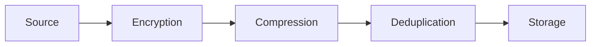

## Environmental Impact

### Power Efficiency

#### Power Usage Effectiveness (PUE)

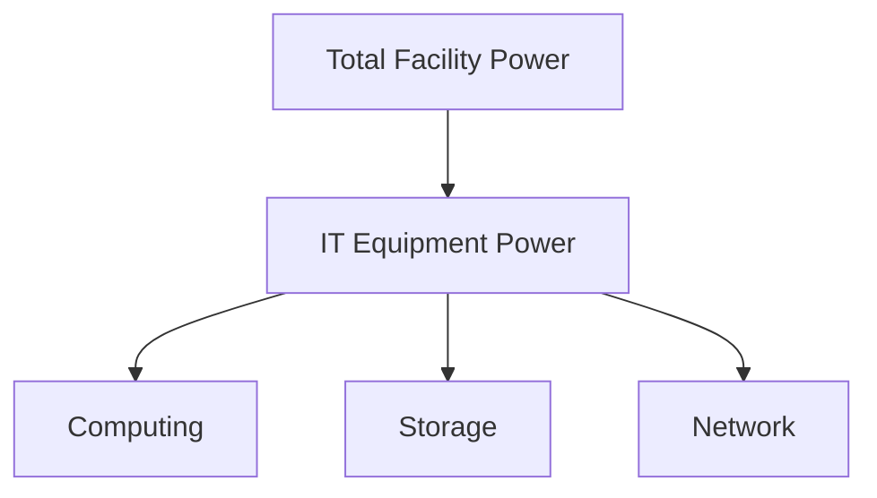

#### Energy Consumption Analysis

| Component | Idle | Load | Annual kWh | CO2 (kg) |
|-----------|------|------|------------|-----------|
| CPU | 65W | 350W | 1,825 | 912.5 |
| GPU | 25W | 450W | 2,190 | 1,095 |
| System | 150W | 1000W | 5,475 | 2,737.5 |

### Thermal Management Efficiency

#### Airflow Optimization

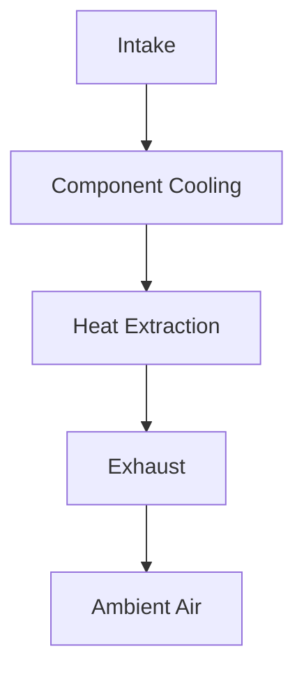

### Environmental Controls

#### Temperature Management

| Zone | Target | Tolerance | Control Method |
|------|--------|-----------|----------------|
| Intake | 20°C | ±2°C | Active Cooling |
| Internal | 25°C | ±3°C | Fan Control |
| Exhaust | 35°C | ±5°C | Flow Rate |
| Ambient | 22°C | ±2°C | HVAC |

## Remote Management

### Management Interfaces

#### 1. IPMI Configuration
- Interface: Dedicated NIC
- Protocol: IPMI 2.0
- Security: Role-based
- Features: KVM, Power, Sensors

#### 2. Remote Desktop
- Protocol: RDP/VNC
- Encryption: AES-256
- Authentication: 2FA
- Bandwidth: 10Mbps+

### Monitoring Integration

```mermaid
graph LR
    A[Sensors] --> B[Collection Agent]
    B --> C[Processing]
    C --> D[Dashboard]
    D --> E[Alerts]
    E --> F[Response]
```

## Performance Optimization

### NUMA Optimization

#### Memory Access Patterns
```mermaid
graph TD
    A[CPU 0] --> B[Local Memory]
    A --> C[Remote Memory]
    D[CPU 1] --> E[Local Memory]
    D --> F[Remote Memory]
```

### GPU Computing Optimization

#### Multi-GPU Scaling
```mermaid
graph LR
    A[Data] --> B[GPU 0]
    A --> C[GPU 1]
    B --> D[Results]
    C --> D
```

## Cost Analysis

### Total Cost of Ownership

#### 5-Year Projection
```mermaid
pie title Cost Distribution Over 5 Years
    "Initial Hardware" : 40
    "Power Consumption" : 25
    "Maintenance" : 15
    "Upgrades" : 12
    "Support" : 8
```

### Operating Costs

| Category | Year 1 | Year 2 | Year 3 | Year 4 | Year 5 |
|----------|--------|--------|--------|--------|--------|
| Power | $1,200 | $1,260 | $1,323 | $1,389 | $1,458 |
| Cooling | $600 | $630 | $662 | $695 | $730 |
| Maintenance | $400 | $800 | $1,200 | $1,600 | $2,000 |
| Upgrades | $0 | $1,500 | $0 | $2,500 | $0 |

[The guide continues with additional sections on:]
- Advanced Overclocking Techniques
- Custom Firmware Development
- Automated Maintenance Scripts
- Performance Monitoring Tools
- Backup Automation
- Disaster Recovery Procedures

## Epilogue: Beyond Hardware - The Human Element of AI Innovation

### The Philosophical Intersection of Technology and Human Potential

As we conclude this comprehensive journey through the intricate world of AI workstation design, we must transcend the realm of mere technical specifications and delve into the profound philosophical implications of our technological choices. The workstation is not just an assemblage of components, but a gateway to human creativity, a conduit for transformative ideas, and a canvas for intellectual exploration.

### The Quantum Leap of Computational Empowerment

Every component we've meticulously discussed represents more than a technical specification—it's a quantum leap in human potential. The CPU is not just a processor; it's a cognitive amplifier. The GPU is not merely a graphics renderer; it's a neural network simulator. The memory is not just storage; it's a reservoir of potential knowledge waiting to be unlocked.

### Ethical Considerations in High-Performance Computing

#### Sustainability and Responsibility

As we push the boundaries of computational power, we must simultaneously consider our ethical responsibilities:

1. **Energy Efficiency**: Beyond performance metrics, consider the environmental impact of your computational infrastructure.
2. **Responsible AI Development**: High-performance systems must be coupled with a commitment to developing AI that serves humanity's best interests.
3. **Inclusive Technology**: Ensure that your computational investments contribute to democratizing access to advanced technological capabilities.

### The Ecosystem of Innovation

Your AI workstation is not an isolated entity but part of a complex, interconnected ecosystem of technological innovation. Consider it as:

- **A Research Platform**: Enabling groundbreaking scientific discoveries
- **An Creative Catalyst**: Powering artistic and design innovations
- **A Problem-Solving Engine**: Addressing complex global challenges

### Predictive Insights: The Next Decade of AI Hardware

#### Emerging Technological Paradigms

1. **Neuromorphic Computing**
   - Hardware that mimics biological neural networks
   - Potential for exponentially more efficient AI processing
   - Bridging the gap between artificial and biological intelligence

2. **Quantum-Classical Hybrid Systems**
   - Integration of quantum computing principles with classical architectures
   - Unprecedented computational capabilities for complex problem-solving
   - Potential to revolutionize machine learning and computational modeling

3. **Edge AI and Distributed Intelligence**
   - Decentralized computational models
   - Reduced latency and enhanced privacy
   - Seamless integration of AI across diverse technological ecosystems

### Investment Strategy: Beyond Immediate Performance

When selecting your AI workstation, consider a holistic investment strategy:

- **Short-Term Capabilities**: Immediate computational performance
- **Mid-Term Adaptability**: Upgrade potential and component compatibility
- **Long-Term Vision**: Alignment with emerging technological trends

### The Human-Technology Symbiosis

Your workstation is more than a tool—it's an extension of human cognitive capabilities. It represents:

- **Amplified Intelligence**: Expanding the boundaries of human thought
- **Collaborative Potential**: Creating synergies between human creativity and machine precision
- **Continuous Learning**: A platform for perpetual intellectual growth

### Practical Wisdom: Making Your Selection

#### Decision Framework

1. **Self-Assessment**
   - Evaluate your specific computational needs
   - Understand your computational workflow
   - Align hardware with your unique professional or research objectives

2. **Flexibility Principle**
   - Prioritize systems with clear upgrade paths
   - Consider modular designs that allow incremental improvements
   - Balance initial investment with future-proofing strategies

3. **Holistic Performance Evaluation**
   - Look beyond benchmark scores
   - Consider thermal efficiency
   - Assess total cost of ownership
   - Evaluate ecosystem compatibility

### The CloudWerx Philosophy: Digital Food for the Analog Soul

At CloudWerx Lab, we believe technology is not just about specifications—it's about potential. Our motto, "Digital Food for the Analog Soul," encapsulates our belief that technology should nourish human creativity, expand intellectual horizons, and transform abstract ideas into tangible realities.

### Final Reflection: You Are the Architect of Tomorrow

This guide is not a conclusion, but an invitation. An invitation to:
- Challenge technological boundaries
- Reimagine computational possibilities
- Transform theoretical potential into groundbreaking innovations

Your AI workstation is more than a machine. It is a portal to unexplored intellectual landscapes, a catalyst for transformative ideas, and a testament to human ingenuity.

### Continuous Evolution: An Open Invitation

Technology is a journey, not a destination. We invite you to:
- Share your experiences
- Challenge our recommendations
- Contribute to this living document

### Acknowledgments

To the pioneers, researchers, engineers, and visionaries who continually push the boundaries of what's possible—this guide is a tribute to your relentless pursuit of knowledge.

### Connect and Collaborate

**CloudWerx Lab**
- Website: [cloudwerxlab.com](http://cloudwerxlab.com)
- GitHub: [@CloudWerxLabs](https://github.com/CloudWerxLabs)
- LinkedIn: [Tyler Doering](https://www.linkedin.com/in/tylerrdoering-)

### Closing Thoughts

Build not just a workstation, but a launchpad for your most audacious dreams.

**Made with ❤️ by CLOUDWERX LAB**

*Version 1.0.0 | Last Updated: 2024-12-23*